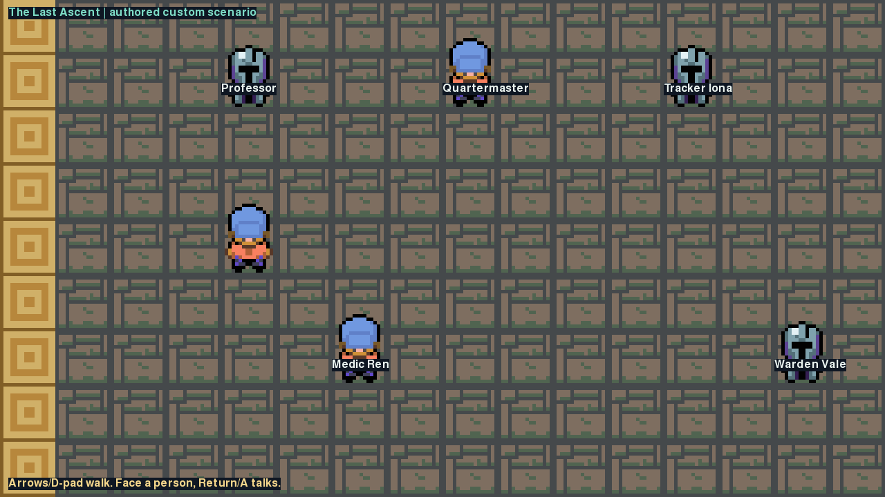
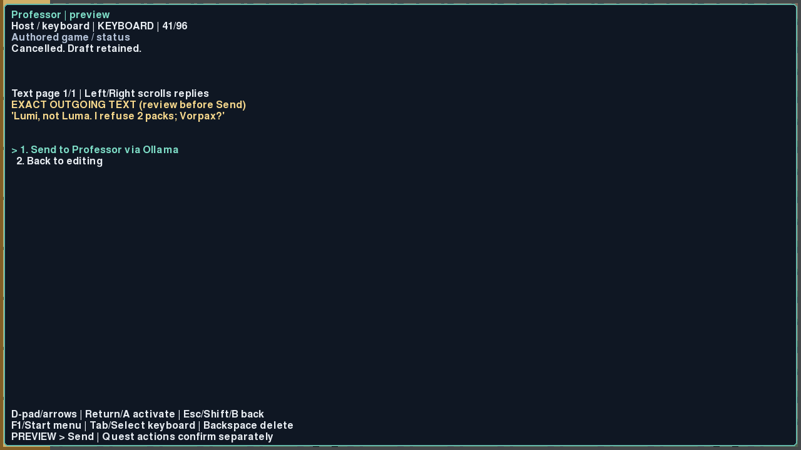
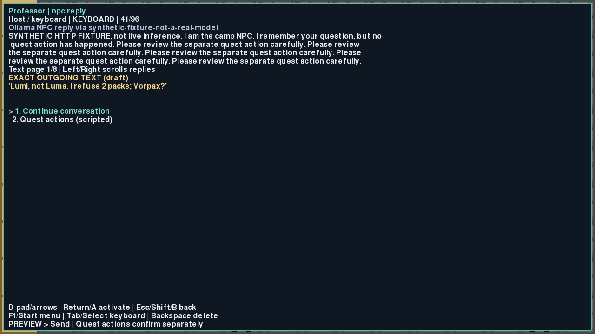

# Custom Tuxemon integration review

The implementation starts at `origin/main`
`6d3fb1e7b4590183b53a33f7d6ff86aa39e87c00`. Product code and verified rendering
artifacts are in commit `4c349be2181a79e22a76fbd8703d9601cedbca8a` on
`codex/custom-tuxemon-cloud`. A documentation-only follow-up records this review.
The implementation used an isolated cloud checkout and the actual Python/Pygame
Tuxemon engine. Nothing depends on Sam's Mac.

## Changes

- `run_tuxemon.py --custom-game` launches an opt-in Last Ascent TMX camp through
  the existing LocalPygameClient and WorldState. Five real NPC records use normal
  map interaction events, movement, collision and rendering. No standalone game
  or ROM replaces the engine. Normal startup remains unchanged.
- The conversation state has all nine researched editor approximations, a method
  menu, D-pad/A/B/Start/Select controls, immediate normal-keyboard switching,
  exact preview and explicit Send. Both Return and controller A activate each
  editor. Shift types capitals in keyboard mode instead of invoking B. Controls
  remain visible while long NPC replies are paged.
- The configurable Ollama `/api/chat` adapter separates NPC/system and player
  roles, includes bounded per-NPC history, preserves exact outgoing drafts, and
  performs requests in one bounded daemon worker. Cancellation, closing/reopening,
  HTTP/protocol errors and socket timeouts preserve drafts and reject late results.
  There are no account-auth imports, model purchases, downloads or fake fallbacks.
- Quest actions have a separate selection and confirmation. Authored guards
  recheck real engine inventory and flags before `add_item`/`set_variable` actions.
  Namespaced items and flags prevent scenario reset from changing campaign data.
  Tests cover a one-pack exchange, repeated-trade refusal, name correction,
  safe-route prerequisites, risky-route refusal, permit issuance and aid-kit use.
- A gettext compiler compatibility fix invalidates only the catalog it rewrites.
  A reproducer failed before the fix and passed afterward. This avoids stale
  translations rejecting new quest-item names in an existing installation.
- Checked-in setup scripts rebuild a repository-local Python environment and
  rootless Debian Xvfb. The lockfile retains the seven-day release-age cutoff,
  resolved against October 1 for the October 8 task.

## Verification

| Check | Result |
| --- | --- |
| Actual-game acceptance, endpoint validation and gettext compatibility under SDL | 7 passed, 13.36 seconds |
| Same checks under repository-installed Xvfb/X11 | 7 passed, 74.10 seconds |
| Existing config/input/map-event/map-manager/NPC-manager tests | 122 passed, 3.39 seconds |
| Real CLI `--custom-game` route | Spawn, walking and Return NPC interaction passed |
| Real CLI normal route | Existing Splash/Intro startup passed |
| Ruff, formatting, shell syntax and diff whitespace | Passed |
| Binary-capable diff applied to exact base | All tracked/new/binary files matched the implementation tree |

The actual-game journey uses Pygame key-down/key-up events through the real input
manager and map event engine. Controller A goes through EventManager for each
editor. It walks to all five NPCs, sends a follow-up, pages a long reply, exercises
HTTP errors/malformed responses/timeouts, cancels and reopens a conversation,
preserves separate NPC drafts/history, confirms guarded effects, resets the story,
and reconstructs runtime state without resetting existing engine items/flags.
There are no direct cursor or player-position mutations in that journey.

The 122-test selection covers the nearby existing systems. It is not a claim that
the entire repository test suite was run. Multiplayer initialization is disabled
in the single-player acceptance harness to avoid another task's port collisions.

## Evidence and reproduction

[Setup, launch, controls and repeatable test commands](README.md).

[Evidence gallery](evidence/index.html), [capture manifest](evidence/manifest.json),
[SDL results](evidence/integration-final.txt), [Xvfb results](evidence/xvfb-final.txt),
[existing regressions](evidence/regression.txt) and JUnit XML files are retained.
There are 57 PNG captures, including every editor and preview with both Return
and A. Download the gallery with its adjacent PNG files to view it locally.

## Remaining limits

- No cloud Ollama service is configured. Live inference and model quality remain
  unverified. Every inference capture uses a clearly labeled synthetic HTTP
  fixture. These results prove protocol and game integration, not real inference.
- Physical controller hardware was not used. Tests compare real Return keys with
  the engine's controller A events and exercise keyboard equivalents of the other
  controls. There were no hardware writes or ROM builds.
- Drafts are limited to 96 printable ASCII characters. All nine methods keep the
  research's approximations. The ninth method is keyboard input in the same game
  window; network host pairing is not implemented.
- NPC history and drafts last for the client session, with up to 20 completed turns
  per NPC. Full disk save/resume and packaging audit are not claimed here. Existing
  engine flags/items survive scenario-runtime reconstruction.
- No paid models, ChatGPT/Codex model credentials, deployment, merge or main-branch
  push were used. Only the implementation feature branch is delivered for review.
- Supplementary task directories were left untouched. Those packages are not
  prerequisites for this implementation or its verification.
