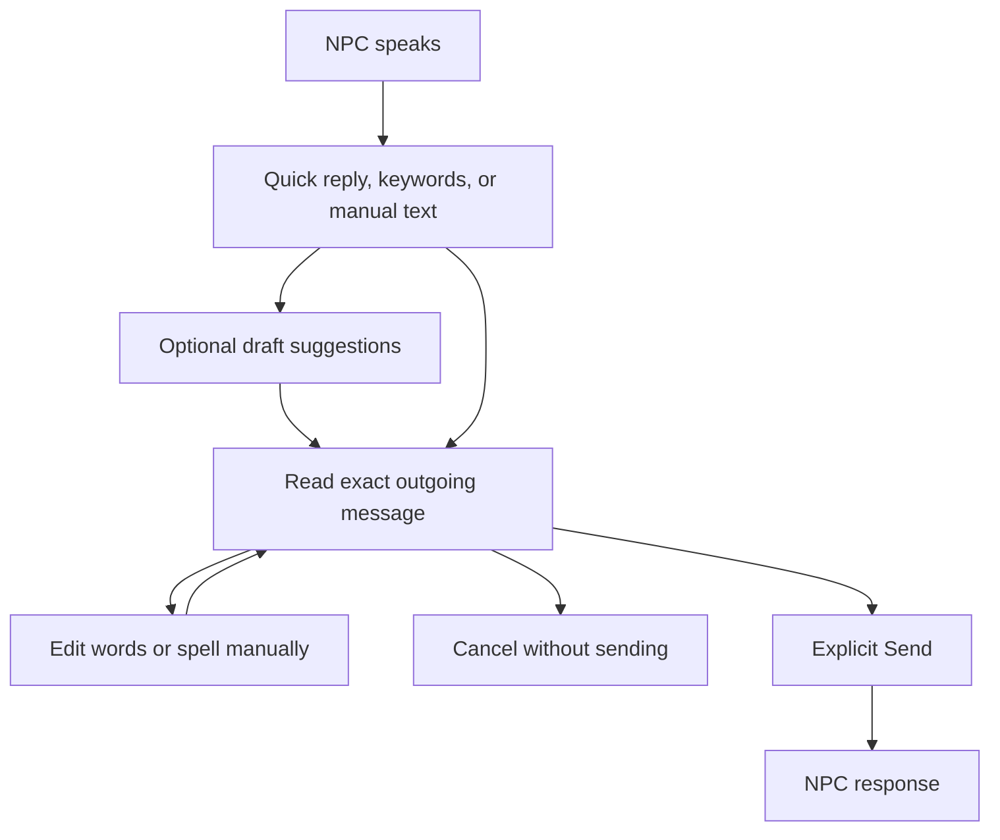

# Text and Conversation Input for Tuxemon on Chromatic

Research checked October 5, 2026. Recommend a hybrid composer: select keywords or a conversation goal, review model-generated wording, and retain a manual spelling option. This gives the player more freedom than fixed dialogue choices without making every sentence a D-pad typing exercise.

The original input recommendations remain design judgments. A local walkable playground now implements eight native composers plus paired Mac entry in an owned PyBoy emulator. No comparative typing-speed tests on Sam's Chromatic were run. No ranking is a measured device result.

## Scope and Local Evidence

Question: How can a player express what they want to say to an NPC using a 160 by 144 display, four directions, and A/B? Which interactions benefit from language models or GLiNER-family classifiers?

The answer combines primary HCI research, inspected public implementations, and the current prototype. HN and Lobsters were used for discovery and failure hypotheses, not as technical authorities. Older input research remains relevant to physical controls; model capability claims require newer sources.

Historical prototype context was inspected before the original web research:

- [Prototype README](../../chromatic_demo/README.md): the current ROM has three conversation choices and precompiled responses. It has no live model request channel.
- [Native renderer](../../chromatic_demo/native/demo.c): D-pad selects an intent, A opens/advances dialogue, and B returns. There is no text editor yet.
- [Companion server](../../chromatic_demo/server.py): requests contain exactly `request_id` and `intent`; only the three known intents are accepted. Arbitrary player text is not currently transported.
- [Hardware findings](../../chromatic_demo/HARDWARE.md) and [firmware prototype](../../chromatic_demo/firmware/README.md): the MCU route is a separate experimental firmware path, still uninstalled and unqualified on hardware.
- `venv/chromatic-firmware/source/components/button/button.c`, especially `Button_GetState`: the inspected MCU layer suppresses Select and consumes button events. Menu controls the system overlay. Do not base the first MCU input design on Select, or repurpose Menu as a typing modifier. The native cartridge path and the MCU path need separate input checks.

Use four cardinal directions plus A/B as the initial design budget. Diagonal chords, long holds, and repeat behavior need physical tests. A microphone or phone-input bridge is not implemented in this prototype.

Sam clarified that "Jev style models" meant the GLiNER family of text classifiers. The current experiment uses GLiClass to rank allowed NPC action labels. JEPA was an earlier provisional interpretation and does not drive the current recommendation.

The original pass found no earlier matching text-entry research or Tuxemon/Chromatic docs-spec site. This memo preserves the research; the playground guide and verification record describe later implementation. No publication or deployment is established here.

## Evidence That Matters

**Keyword expansion has a relevant precedent.** KWickChat generates candidate sentences from keywords, conversation history, and persona using GPT-2. Its 2022 evaluation used envelope analysis and semantic judges, rather than a deployed-user usability study. It supports the mechanism, not a claim that keyword entry will be faster or preferable on a game handheld. [Author paper](https://www.pokristensson.com/pubs/ShenEtAlIUI2022.pdf), [research implementation](https://github.com/CambridgeIIS/KWickChat).

**Shorthand needs a recovery path.** SpeakFaster combines word initials with partially or fully spelled keywords and word replacement. Its evaluation included mobile input and two eye-gaze communicators; those conditions do not establish gamepad performance. The authors discuss cognitive overhead, small-screen correction costs, and manual spelling when predictions fail. The published system used specialized fine-tuned models; an ordinary prompted LLM must be tested separately. [Primary preprint and full text](https://arxiv.org/html/2312.01532v1), [2024 journal version](https://www.nature.com/articles/s41467-024-53873-3), [UI/data repository](https://github.com/TeamGleason/SpeakFaster). The journal page could not be fully fetched; implementation details here were checked against the accessible preprint. Public UI code does not establish availability of the original proprietary model weights.

**Four-button gestures are a real input method.** Wobbrock and Myers' ASSETS 2005 demonstration includes EdgeWrite using four keys/buttons and adaptive character segmentation. Its reported performance examples concern experts, including authors. The relevant finding is feasibility with few discrete inputs, not a transferable speed estimate. A D-pad mapping remains an adaptation requiring evaluation. [Author PDF](https://faculty.washington.edu/wobbrock/pubs/assets-05.01.pdf), [project overview](https://depts.washington.edu/ewrite/home.html).

**Predictive navigation need not require an LLM.** Dasher is a zooming predictive text-entry system. Its public source tree contains button, multipress, compass, and language-model components. That supports investigating a button-operated variant. It does not establish that the desktop application can run on the Chromatic or that a moving zoom interface is readable at this resolution. Individual button-mode source retrieval failed, so this pass verified the component inventory, not a complete button-mode implementation. [Project](https://github.com/dasher-project/dasher), [core source inventory](https://github.com/dasher-project/dasher/tree/master/Src/DasherCore).

**Daisywheel is a useful reference with a control mismatch.** Valve documents the historical controller typing interface. Chris Dolphin's inspectable implementation selects a letter group using an analog stick, then a character using one of four face buttons; shoulder buttons change modes. Our initial A/B budget cannot reproduce that mapping directly. The old Valve landing page is historical evidence, not confirmation that the current Steam client exposes the same interface. [Valve page](https://store.steampowered.com/bigpicture/), [implementation](https://github.com/likethemammal/daisywheeljs), [author's control documentation](https://likethemammal.github.io/daisywheeljs/).

## Options and Tradeoffs

The following fits are recommendations inferred from the control budget and evidence above. They are not user-test results.

| UX | What the Player Does | Model's Job | Fit for This Prototype | Main Cost |
|---|---|---|---|---|
| Intent/topic/stance composer | Choose a goal, subject, and optional stance; review the sentence | Generate several meaning-preserving drafts | Strong default candidate | The available goals can constrain expression; wording may add unintended meaning |
| Keyword chips | Add or type a few important words, then choose a draft | Expand the selected concepts using NPC context | Strong free-expression candidate, informed by KWickChat | Keyword order and negation can be ambiguous |
| Initials plus keywords | Enter initials; spell a difficult word; choose an expansion | Constrained abbreviation expansion and targeted correction | Promising optional mode, informed by SpeakFaster | Initialism planning and reading candidates can cancel motor savings |
| Stable keyboard plus predictions | Navigate a fixed character grid and accept optional word completions | Rank words, optionally using conversation context | Essential exact-input baseline and escape route | Many directional moves for long messages |
| Grouped alphabet | Pick a fixed group, then a letter within it | Optional completion or ambiguity ranking | Good alternative to test against a flat grid | Extra stages and group learning; ambiguous entry still needs correction |
| Four-button EdgeWrite adaptation | Enter learned direction sequences for characters/words | Optional word completion; gesture recognition is a separate mechanism | Expert-mode experiment | Training, segmentation, and missed/diagonal input ambiguity |
| Button-operated Dasher-inspired navigation | Select progressively narrower predicted text regions | Assign probabilities to the branches | Research experiment, not first release | Motion, small targets, and unfamiliar reversal/correction |
| Daisywheel-inspired radial groups | Select a group, then choose its letter using another step | Optional prediction | Borrow grouping, not the original control mapping | Only two face buttons; no analog stick or shoulders in the initial budget |
| Paired phone/Mac text entry | Type or dictate externally, then review on handheld | Optional transcription, completion, or rewriting | Useful optional route for long messages | Pairing, another device, and transport dependency; not a standalone handheld experience |

A four-group ambiguous alphabet is not literally T9, which uses a different keypad layout. Borrow reduced-key disambiguation as a principle, and test the actual new mapping. Keep a way to spell a new name exactly.

## Recommended Interaction

Start with a keyword composer backed by a stable manual keyboard. Add abbreviation expansion as an optional mode after the baseline is usable. Provide authored quick replies for common interactions and offline operation.

**Proposed example, not a model result or measured interaction:** the player chooses `Ask`, `Rockitten`, and `weakness`. A possible draft is “What is Rockitten weak against?” The player reviews and sends that exact text. The example specifies desired behavior; no model was called to produce it during this research.

The model should help compose the player's outgoing message. NPC response generation is a separate stage that begins only after the player commits a message. Do not confuse the two speakers, or treat selecting a suggested topic as consent to a hidden full utterance.

### Controls and Screen Layout

Proposed mappings for evaluation:

- D-pad moves a visible focus among stable choices.
- A selects an item, accepts a word, or advances a preview page. Sending requires a distinct focused `Send` action; merely reaching the final page does not send.
- B goes back one composition step while preserving the draft. Keyboard backspace is a visible action, avoiding an undocumented overload of B.
- On-screen actions expose `Suggestions`, `Spell`, `Edit`, `Send`, and `Cancel`, without requiring Select or Menu shortcuts.

Use a dedicated composition screen. Keep a compact NPC/context heading, a visible draft or keyword strip, and a small number of choices. Initially test three candidate glosses, with a separate full-message preview. A gloss never replaces the exact text the player approves. These counts are proposed design parameters, not measured optimal values.

Freeze candidate positions once focus enters them. Replace them only after an explicit refresh or completed editing step. Keep the character layout fixed even when suggestions change. Show predictions in a separate strip rather than moving letters under the thumb.

Preserve nouns, negation, speaker stance, quantities, and uncertainty when expanding a draft. A wish such as learning a new ability must not silently become a claim that the ability already exists. Allow the player to reject all candidates, type an unknown subject, and submit literal text unchanged.

### Model and Connectivity Behavior

Do not query a remote model for each D-pad move. Use local word lists or cached candidates during navigation; request new drafts at a meaningful composition boundary. Never present typing support as contingent on a network response.

Keep editing active while generation runs. Bind suggestions to the draft/context version that requested them. Discard late results after edits or leaving the screen, and preserve the draft after failure. Do not silently truncate a player's message to a transport limit; show the limit and let the player edit.

Store raw composition input separately from the chosen outgoing text. Only the confirmed text enters NPC dialogue history. Keep game actions, rewards, inventory, and quests under deterministic game validation. Model wording must not execute a game action.

The original three-intent companion schema does not transport arbitrary player messages. The later `playground_bridge.py` adds player drafts and label picking inside its owned PyBoy instance. The native ROM's physical live communication problem remains separate; emulator input comparison does not require installing experimental firmware.

## GLiNER-Family Classification in the Playground

Sam clarified the intended model family after this memo's initial pass. The implemented experiment uses GLiClass, a GLiNER-family text classifier, to rank concise descriptions of allowed NPC actions. It does not generate player or NPC prose. Ollama separately composes optional outgoing player drafts; authored NPC prose and deterministic game guards handle responses and effects.

The local implementation pins `knowledgator/gliclass-edge-v3.0` and its snapshot hashes in `chromatic_demo/npc_picker.py`. It accepts a caller-provided mapping from stable action IDs to short action descriptions. The bridge supplies descriptions from `classifier_label`, then `label_description` as a fallback. The classifier currently ignores the optional opening-context argument. See [picker source](../../chromatic_demo/npc_picker.py), [bridge source](../../chromatic_demo/playground_bridge.py), and [authored world](../../chromatic_demo/worlds/last_ascent.json).

Scores are uncalibrated. The local policy abstains below a leading score of 0.80 or a top-two margin of 0.03. These gates are policy choices, not estimates of correctness. The [canonical 25-input authored world probe](../../build/chromatic/playground/picker-world-probe.json), recorded October 5, 2026 at 21:41:46 UTC, matched 6 expected labels. It used the current `classifier_label` descriptions and all six actions per NPC, as the runtime bridge does. Earlier experiments used different labels and candidate filters; their counts do not describe this configuration. This is a local fixture result, not a benchmark or evidence of reliable gameplay intent recognition. Negation, unknown nouns, corrections, and quantities need explicit player confirmation. Model labels cannot execute trades, consume items, or advance quests by themselves.

The native UI previews the exact outgoing message and asks the player to confirm the proposed meaning. The player can choose an authored meaning or edit the message after abstention or a wrong suggestion. Item masks, quest prerequisites, and repeat-reward restrictions are checked only when the player confirms. See the [playground guide](../../chromatic_demo/PLAYGROUND.md) for the actual nine interfaces and operating controls.

## Historical JEPA Interpretation

The earlier draft provisionally interpreted Sam's phrase as JEPA/world models. That interpretation has been superseded by the GLiNER-family clarification. The following links remain historical research references, not current model recommendations.

V-JEPA 2 predicts representations for video understanding and planning, with language alignment described separately. VL-JEPA predicts target-text embeddings and invokes a decoder when text is needed; it also supports retrieval/classification. Neither paper established a turnkey D-pad text composer for this project. [V-JEPA 2, June 2025](https://arxiv.org/abs/2506.09985), [VL-JEPA, February 2026 revision](https://arxiv.org/abs/2512.10942).

## What to Avoid

- A fixed dialogue wheel as the only route, because it does not let players say anything outside its options.
- Automatic submission, unannounced rewriting, or additions that change player intent.
- Large candidate lists or long generated drafts that make reading/correction dominate input effort.
- Moving letters, changing button meanings without visible labels, or requiring timed chords for basic use.
- Treating language-model guesses as a recognition oracle, especially for invented creature names and negation.
- Treating motor-action savings from AAC research as measured gamepad speed, enjoyment, or accessibility results.
- Treating an old Daisywheel or Dasher implementation as a validated drop-in library for this hardware.
- A phone or voice dependency as the only way to converse, or assuming the existing ChatGPT sign-in route includes speech transcription.

## Evaluation to Run Next

Compare three initial variants: fixed keyboard with a prediction strip; keyword composer plus drafts; initials/keyword expansion using the same manual keyboard. Hold the NPC scene, fonts, display size, and Send/Edit controls constant. Add grouped alphabet or EdgeWrite after finding the largest remaining cost.

Use both prescribed messages and player-authored messages. Evaluate short greetings, a precise question, an unfamiliar name, a refusal with negation, a follow-up correction, and a deliberately unusual idea. These are test categories, not collected observations.

Measure time to a correctly committed message, button events, editing/deletion, prediction rejection, time spent reading candidates, accidental sends, abandonment, and the player's assessment of whether it said what they meant. Include first-use and learned use, and network failure/late-result trials. Define timing boundaries before collecting results; do not substitute model response latency or character counts for end-to-end communication.

The key criterion is preserved meaning with tolerable effort. A design that reduces typing while increasing reading and correction may lose overall. No winning variant, typing speed, or confidence interval is claimed yet.

## Source Register

Primary sources opened during this pass:

1. [KWickChat author paper](https://www.pokristensson.com/pubs/ShenEtAlIUI2022.pdf), IUI 2022. Keyword-conditioned generation; evaluation limits explicit.
2. [CambridgeIIS/KWickChat](https://github.com/CambridgeIIS/KWickChat). Inspectable model implementation, not proof of handheld UX suitability.
3. [SpeakFaster full preprint](https://arxiv.org/html/2312.01532v1), December 2023; [journal version](https://www.nature.com/articles/s41467-024-53873-3), November 2024. Abbreviation expansion, correction, and cognitive/screen costs.
4. [TeamGleason/SpeakFaster](https://github.com/TeamGleason/SpeakFaster). UI/data reference; no claim that original model weights are available.
5. [Wobbrock and Myers, Gestural Text Entry on Multiple Devices](https://faculty.washington.edu/wobbrock/pubs/assets-05.01.pdf), ASSETS 2005. Four-button/key feasibility and expert-study limitations.
6. [EdgeWrite project](https://depts.washington.edu/ewrite/home.html). Alphabet and feedback overview; this pass does not assess current legal status or reuse rights.
7. [Dasher](https://github.com/dasher-project/dasher), [core input/language-model inventory](https://github.com/dasher-project/dasher/tree/master/Src/DasherCore). Source validation of the predictive-navigation design family.
8. [Valve Big Picture landing page](https://store.steampowered.com/bigpicture/). Historical Daisywheel precedent; page includes old system requirements.
9. [DaisywheelJS source](https://github.com/likethemammal/daisywheeljs), [author control documentation](https://likethemammal.github.io/daisywheeljs/). Analog-stick/four-face-button dependency verified; performance marketing not adopted.
10. Historical, superseded model-family interpretation. [V-JEPA 2](https://arxiv.org/abs/2506.09985), June 2025; [Meta publication](https://ai.meta.com/research/publications/v-jepa-2-self-supervised-video-models-enable-understanding-prediction-and-planning/). Visual/state prediction and separate language alignment.
11. Historical, superseded model-family interpretation. [VL-JEPA](https://arxiv.org/abs/2512.10942), December 2025, revised February 2026. Semantic embeddings, retrieval/classification, and selective text decoding.

Discovery sources, not technical evidence for the recommendations:

- [HN, One-Handed Typing](https://news.ycombinator.com/item?id=44173581): discovery of Dasher and accounts of motor/cognitive tradeoffs.
- [Lobsters, The Case for a New Input Method](https://lobste.rs/s/jkeeh8/case_for_new_input_method): discoverability, learning, and visible-reference concerns.
- [HN, Transformer Predictive Text](https://news.ycombinator.com/item?id=37541093): hypothesis that plausible continuation can differ from intended wording.

This research pass originally authored only the memo. The later playground implementation is documented separately in the playground guide and verification record. This amendment changes only the research record; it does not establish hardware installation, publication, or live radio communication.
